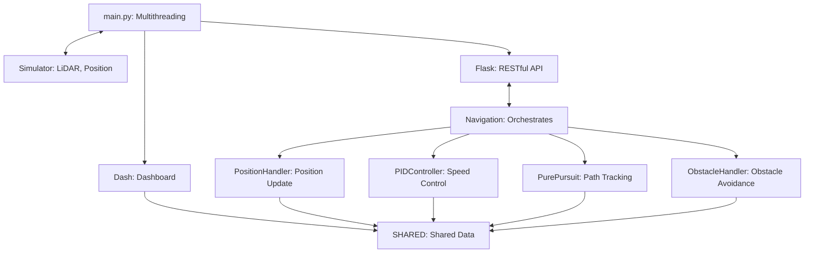

# 전차 내비게이션 시스템 (Tank Navigation System)

전차의 실시간 내비게이션, 장애물 회피, 속도 제어를 위한 시뮬레이션 플랫폼입니다. Flask 기반 백엔드와 Dash 기반 프론트엔드를 통합하여 데이터를 처리하고 대화형 대시보드를 제공합니다. LiDAR 데이터를 활용해 Pure Pursuit 경로 추적, PID 제어, DBSCAN 클러스터링을 통해 강력한 내비게이션과 장애물 처리를 구현합니다.

## 목차

- [기능](#기능)
- [아키텍처](#아키텍처)
- [모듈 다이어그램](#모듈-다이어그램)
- [사용 방법](#사용-방법)
    - [대시보드 접근](#대시보드-접근)
    - [파라미터 조정](#파라미터-조정)
- [프로젝트 구조](#프로젝트-구조)


## 기능

* **실시간 내비게이션**:
    * Pure Pursuit 알고리즘으로 목적지까지 경로 추적.
    * API를 통한 동적 목적지 설정.
* **장애물 회피**:
    * DBSCAN 클러스터링으로 LiDAR 데이터 처리 및 장애물 감지.
    * 정지, 감속, 좌/우 회전 등 회피 동작 수행.
    * KDTree로 장애물 우회 경로 생성.
* **속도 제어**:
    * PID 제어로 목표 속도(-30~70 km/h) 유지.
    * 대시보드를 통해 속도 및 PID 파라미터 조정.
* **대화형 대시보드**:
    * Dash/Plotly로 실시간 시각화: 전차 위치, 경로, 속도, 위치 변화 그래프.
    * 장애물 클러스터 및 통계(개수, 평균 거리).
    * PID 게인, 내비게이션 파라미터, DBSCAN 설정 동적 조정.
* **RESTful API**:
    * Flask로 시뮬레이터와 통신(초기화, 위치/장애물 업데이트).
* **스레드 안전 데이터 공유**:
    * 공유 데이터(`SHARED`)와 스레드 락으로 Flask/Dash 간 안전한 데이터 접근.

## 아키텍처

시스템은 두 가지 주요 구성 요소로 나뉩니다:

* **백엔드 (Flask)**: RESTful API로 시뮬레이터 데이터(LiDAR, 위치) 처리. Navigation 및 하위 모듈로 내비게이션 로직 수행. 스레드 안전 공유 데이터(`SHARED`)에 상태 저장.
* **프론트엔드 (Dash)**: 웹 기반 대시보드로 실시간 모니터링 및 제어. Plotly로 데이터 시각화, 사용자 입력 처리.

**데이터 흐름**:

시뮬레이터가 Flask API로 데이터 전송 -> Navigation이 데이터를 처리, 이동 명령 생성 -> 상태를 `SHARED`에 저장, Dash가 이를 시각화 -> Dash 사용자 입력이 `SHARED`를 통해 시스템에 반영.

## 모듈 다이어그램

아래는 시스템 모듈 간 관계를 나타내는 Mermaid 다이어그램입니다.



## 사용 방법

### 대시보드 접근

웹 브라우저에서 `http://localhost:8050` 에 접속하여 대시보드를 사용할 수 있습니다.

표시 항목:
* 전차 위치/경로 (맵).
* 속도/위치 변화 그래프.
* 장애물 통계(개수, 평균 거리).
* 속도, PID, 내비게이션 설정 조정.


### 파라미터 조정

대시보드에서 다음 파라미터들을 실시간으로 조정할 수 있습니다:
* PID 게인 (Kp, Ki, Kd).
* 내비게이션 설정 (MOVE\_STEP, TOLERANCE, OBSTACLE\_RADIUS 등).
* DBSCAN 설정 (DBSCAN\_EPS, DBSCAN\_MIN\_SAMPLES).

변경 사항은 실시간으로 `SHARED['CONFIG_PARAMS']`에 반영됩니다.


## 프로젝트 구조

```
├── assets/                    # 정적 자산 (CSS, JS 등)
├── config/
│   ├── config.py              # 내비게이션 파라미터 (MOVE_STEP, TOLERANCE 등)
│   └── shared_config.py       # 공유 데이터 (SHARED, SERVER_CONFIG 등)
├── navigation/
│   ├── navigation.py          # 핵심 내비게이션 로직
│   ├── position_handler.py    # 위치, 방향, 속도 관리
│   ├── pid_controller.py      # PID 속도 제어
│   ├── pure_pursuit.py        # Pure Pursuit 경로 추적
│   └── obstacle_handler.py    # 장애물 감지 및 회피
├── web/
│   ├── app.py                 # Flask API
│   ├── dash_app.py            # Dash 애플리케이션 설정
│   ├── callbacks.py           # Dash 콜백
│   └── layout.py              # Dash UI 레이아웃
│   ├── callbacks.py           # Dash 콜백
│   └── styles.py              # 스타일 상수 정의(필요 시 사용)
├── .gitignore                 # Git이 추적하지 않을 파일 지정 (추가 권장)
├── requirements.txt           # Python 의존성 목록
└── main.py                    # 실행 진입점
```
